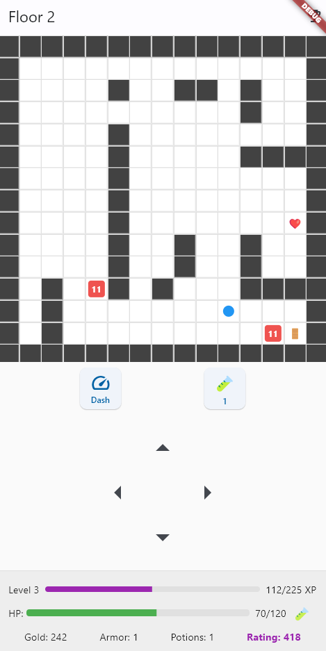

# Dungeon Game

**Dungeon Game** — это простая игра-roguelike, созданная с использованием Flutter. В игре вы управляете персонажем, который перемещается по лабиринту, сражается с врагами, собирает сердца для восстановления здоровья и сундуки с золотом. Ваша цель — найти выход из подземелий, переходя на новые уровни с возрастающей сложностью.



## Содержание

- [Правила игры](#правила-игры)
- [Как играть](#как-играть)
- [Особенности](#особенности)
- [Структура проекта](#структура-проекта)
- [Сборка релизов](#сборка-релизов)
- [Зависимости](#зависимости)
- [Лицензия](#лицензия)

## Правила игры

- **Цель игры:**  
  Пройти как можно больше уровней, находя выходы из лабиринта, развивая персонажа и собирая золото.

- **Характеристики игрока:**
  - **HP (здоровье):** Начальное значение — 100. При столкновении с врагом здоровье уменьшается на величину урона врага.
  - **Броня:** Снижает получаемый урон. Каждый уровень брони даёт дополнительную защиту.
  - **Уровень:** Повышается при получении опыта. Каждый новый уровень увеличивает максимальное здоровье.
  - **Золото:** Используется для покупки улучшений и зелий лечения в магазине.
  - **Зелья лечения:** Восстанавливают 50 HP при использовании.

- **Способности:**
  - **Рывок (Dash):** Позволяет переместиться на 2 клетки в выбранном направлении, игнорируя врагов. Имеет перезарядку.

- **Препятствия и бонусы:**
  - **Враги:** Наносят урон при столкновении. После победы дают золото и опыт.
  - **Сердца:** Восстанавливают здоровье до максимума или дают зелье лечения, если здоровье полное.
  - **Сундуки:** Содержат золото, количество которого увеличивается с уровнем подземелья.
  - **Выход:** Открывает доступ к магазину и переносит на следующий уровень.

- **Магазин:**
  - Увеличение максимального здоровья
  - Улучшение брони
  - Покупка зелий лечения

- **Достижения:**
  Игра включает систему достижений, которые дают дополнительные награды:
  - Золото за выполнение
  - Опыт за разблокировку
  - Особые титулы

## Как играть

- **Управление:**
  - **Клавиатура:** Используйте стрелки для перемещения
  - **Экранные кнопки:** 
    - Стрелки для перемещения
    - Кнопка рывка (когда доступна)
    - Кнопка использования зелья

- **Советы:**
  - Используйте броню для снижения получаемого урона
  - Накапливайте золото для покупки улучшений
  - Применяйте рывок для избегания сильных врагов
  - Следите за здоровьем и запасом зелий
  - Собирайте опыт для повышения уровня

## Особенности

- **Процедурная генерация:** Каждый уровень создаётся случайным образом
- **Система прогрессии:** Развитие персонажа через уровни и улучшения
- **Тактические решения:** Выбор между сражением и обходом врагов
- **Достижения:** Особые награды за выполнение целей
- **Система рейтинга:** Оценка успешности прохождения

## Структура проекта

```
/dungeon_game
├── lib/
│   ├── models/
│   │   └── game_state.dart  # Игровая логика и состояние
│   └── screens/
│       └── game_screen.dart # Пользовательский интерфейс
├── pubspec.yaml             # Зависимости проекта
└── README.md
```

## Сборка релизов

### Предварительные требования

- Flutter SDK
- Для Android: Android Studio и SDK
- Для iOS: Xcode (только macOS)
- Для десктопов: соответствующие настройки Flutter

Подробные инструкции по сборке можно найти в [официальной документации Flutter](https://flutter.dev/docs/deployment/android).

## Зависимости

- Flutter SDK
- Dart SDK

## Лицензия

Проект распространяется под лицензией MIT. См. файл [LICENSE](LICENSE).

